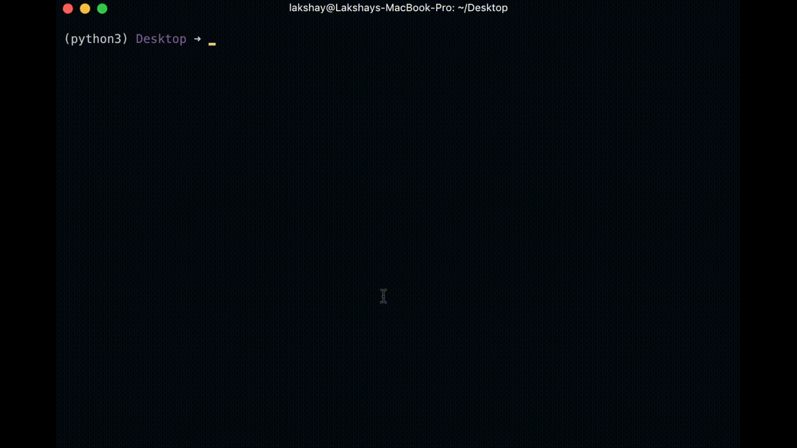

<h2> M E M E &nbsp; D E N S I T Y </h2>
#### Tells you the approximate amount of memes in your facebook newsfeed.


## Preface
Since April 2016, Facebook has been automatically adding alt tags to all images with keywords representing the content of the images:

```html

```

They are labeling the images using a [Deep ConvNet](https://medium.com/@ageitgey/machine-learning-is-fun-part-3-deep-learning-and-convolutional-neural-networks-f40359318721#.2zrawvage) built by Facebook's [FAIR team](https://research.fb.com/category/facebook-ai-research-fair/) team.

On one hand, this is really great. It improves accessibility for blind users who depend on screen readers which are only capable of processing text. But raises privacy concerns too.
###### Thank you [ageitgey](https://github.com/ageitgey/show-facebook-computer-vision-tags) for originally finding out about this.

##### Anyhow, this script uses this addition by Facebook to it's advantage. MemeDensity reads alt tags of the images in your newsfeed and lets you know the quantity of memes on your feed. 

##### Since Facebook doesn't directly allow fetching the newsfeed from its API, this script uses Selenium and PhantomJS to simulate a surf through the newsfeed.

## Dependencies

##### PhantomJS or any other webdriver.

#### MacOS
```sh
brew install phantomjs
```
#### Linux
```sh
sudo apt-get install phantomjs
```
#### Windows
[Download and set in environment variables](http://phantomjs.org/)

## Installing

#### From Source:
Check out the latest [release](https://github.com/lakshaykalbhor/MemeDensity/releases)
##### or
```sh
$ git clone https://github.com/lakshaykalbhor/MemeDensity
$ cd MemeDensity
$ python setup.py install
```

#### From PyPI:
```sh
$ pip install memedensity
```
<br>

If you'll be using a different webdriver (Not PhantomJS), simply edit [MemeDensity/command_line.py](https://github.com/lakshaykalbhor/MemeDensity/blob/master/MemeDensity/command_line.py) and add your webdriver
```py
driver = webdriver.PhantomJS()
```
## Options
```
optional arguments:
  -h, --help            show this help message and exit
  -C, --count           How many times to scroll newsfeed (default = 5)
  -L, --login           Input login credentials
  -v, --verbose         Shows meme urls
```

## Usage
```sh
$ memedensity
```
## Contributing
Currently this project is in its infancy and issues are bound to arise. If the script throws an exception, please make sure to check your running processes to see whether the webdriver has been closed or not. 
To contribute, [post issues](https://github.com/lakshaykalbhor/MemeDensity/issues) without hesitation and [open pull requests](https://github.com/lakshaykalbhor/MemeDensity/pulls) to add/improve features.

## License 
#### [MIT](https://github.com/lakshaykalbhor/MemeDensity/blob/master/LICENSE)

